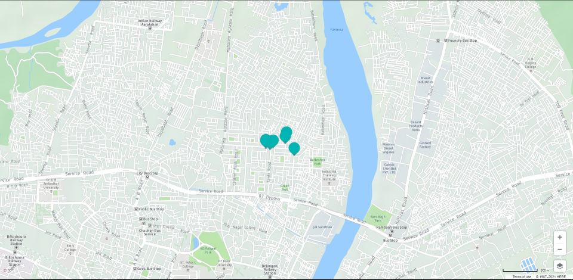

# Health-A-Plenty
# Health a plenty is an online platform to run your health diagnostics. 

The search is over. We present to you ‘Health-A-Plenty’ where you can diagnose any of the main disease such as Heart,Liver Disease, Breast Cancer, Diabetes, Malaria, Pneumonia.
Also you can check your COVID-19 Symptoms and can get the possibility whether you having COVID or not.


## Requirements
Python 3.8 or above with all [requirements](requirements.txt) dependencies installed. To install run:
```python
$ pip install -r requirements.txt
```

## Our Inspirarion
As we look into the current scenario of the modern world, it's clearly visible that people are comparitively falling ill and though the death ratio is comparitively decreasing but still at a very low rate compared to what it can be. The one main reason of this is the lack of proper knowledge and a regularity check on your health. 

What we do is with the help of our website you can check your medical status to ensure that you are completely safe or may require a doctor for your current health status. Due to unavailability of proper resources we still have access to only some of the major diseases like some heart disease, liver disease, malaria, pneumonia, breast cancer and the most common one diabetes.


## How to Run :
1. Install all the dependencies using [requirements](requirements.txt) file
2. Now you can the main Website by heading toward **healthcare_app.py** file. Simply run the file in any Code Editor (VS Code, Py Charm, etc..)

```python
$ python healthcare_app.py
```
     
 ## Home
 
 
 ## Diagnose Section
 
 
  ## COVID-19 Detecttor
 
 
  ## First-Aid Section
 
  
  ## Contact Section
 
 
  ## Book an Appointment
 
   
  ## Nearby Hospital
 
 
  ## Nearby Pharmacies
 
